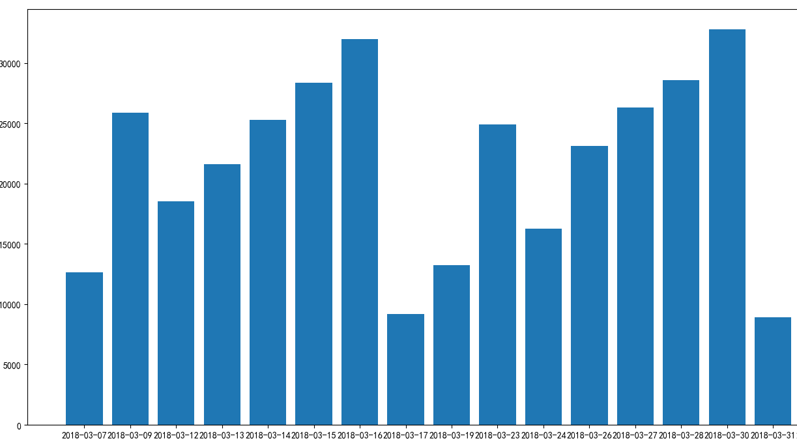

# car-spider 汽车信息抓取工具

# 1.根据城市抓取所有品牌车型的报名信息

# 2.每天抓取一次进行存储

# 3.添加 matplotlib 进行每日报名信息图表统计

----------
#应用库
>scrapy

>numpy

>matplotlib

>pymysql

# 工作笔记

>完善项目目录

>增加 signup_spider

>完善pymsql 存储

>实现matplotlib 图表分析

>增加 car.sql

>xpath应用

#目录
>tuanche
	spiders

		_init_.py
		signup.py
		signup_spider.py

	items.py
	middlewares.py
	pipelines.py
	setting.py

#运行步骤

----------

scrapy crawl signup_spider

### screenshots

  

